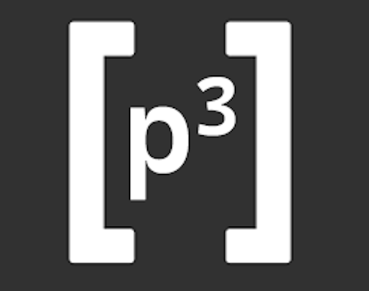

  

<h3 align="center">pCubed | custom programming language</h3>

---

This project was made to explore my capability of making a custom programming language. Its based of the AQA pseudocode programming language.
      

## 📝 Table of Contents

- [About](#about)
- [Authors](#authors)
- [Built Using](#️built_using)

## 🧐 About 

#### Description of this project :
 
...

## ⛏️ Built Using 

- [Python](https://python.com)

## ✍️ Authors 

- [@mxcury](https://github.com/mxcury) - Idea & Work